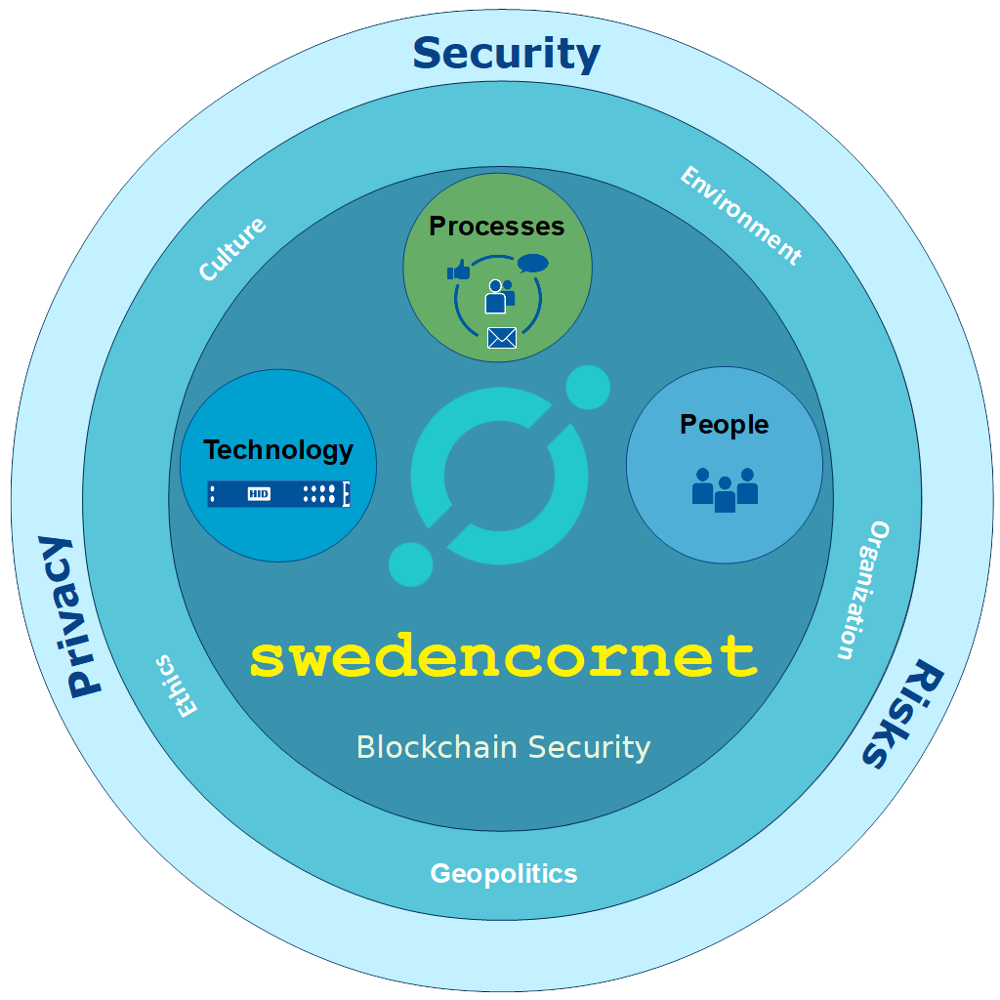
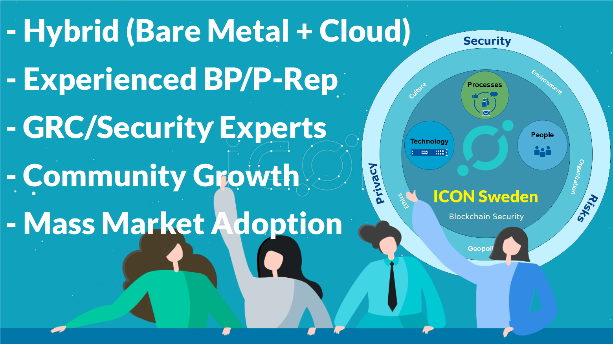

# Welcome to **`swedencornet`** (**ICON Sweden** | **EOSIO**)

**`swedencornet`** (**ICON Sweden** | **EOSIO**) has headquarter in Stockholm. We are located at Kista ICT cluster (also known as The Silicon Valley of Sweden). It is the HUB of Global Enterprises, Universities, and Research Centers.

**`swedencornet`** (**ICON Sweden** | **EOSIO**) manages complex Blockchain Hybrid-Cloud Infrastructures. We provide Security, Privacy, Reliable Operations, Governance, Legal, Compliance and Risks Management Services. We support & strive for Decentralized Community-backed Blocks Production, interconnecting Blockchains and Global Communities.

**`swedencornet`** (**ICON Sweden** | **EOSIO**) is founded by a team of energetic, optimistic, and tech entrepreneurs who are well recognized and have decades of experience in Information Security, Privacy, Operations, Governance, Legal, Compliance and Risks Management. They have served many Global Enterprises within IT, Telecommunition, and Financial Services (Banks) sectors.

Web: https://eossweden.eu/

# RECOGNIZED AND LEADING PLAYER
**`swedencornet`** (**ICON Sweden** | **EOSIO**) has a vision to become a well recognized productive player in the field. We aim to become a hub for Companies, Entrepreneurs, Governments, Public Safety & National Security Organizations, Developers, and Global Communities. **`swedencornet`** (**ICON Sweden** | **EOSIO**) would like to build sound **infrastructure** and **beneficial decentralized applications** on top of wellknown and established blockchain platforms.

*“We are confident that new innovations in Blockchain Technology and Business Models has the potential to fundamentally change The Global Economy and Social Systems. It has the potential to empower it’s communities, it’s user base, as well as involved stakeholders. We are deeply committed to contribute towards the growth of transparent and fare blockchain based ecosystem.”*

Says: – CEO Maliha Mushabbar

We believe that everyone can contribute and benefit from Decentralized Community-backed Blockchain Systems/Platforms. Let's we all work **together** for the **greater good** and **well-being** of all **global** and **local societies/communities**.

# Holistic approach to Information Security and Privacy

**`swedencornet`** (**ICON Sweden** | **EOSIO**) emphasis on fundamentals and sound principles of Information Security and Privacy in all aspects (**ISO 27001/2**, **27017**, **27018**, **CSA CCM**, **OWASP**, **CIS L1**, **L2**, **EU GDPR**, etc.); including but not limited to:

* **People** (Awareness, Culture, Ethics)
* **Processes** (including Governance, Audit & Fraud Detection, Data Breach Notification process)
* **Technology** (including Vulnerability Scanning, OWASP, Pen Testing, Fraud Detection, Forensics, Auditing)
* **Environment**
* **Legislation** (including Compliance, EU GDPR, EU-US Privacy Shield, China Cyber Security Legislation)
* **Geo-Politics**
* **Organization**
* etc…

  

# Experienced BP / P-Rep
We manages complex Hybrid-Cloud Blockchain Infrastructures. We provide Security, Privacy, Reliable Operations, Governance, Legal, Compliance and Risk Management Services. We are Block Producers and have active Block Production Nodes in several Blockchain Projects, such as;

* **ICON Sweden**: https://tracker.icon.foundation/governance
* **Telos**: https://telos.bloks.io/account/swedencornet
* **MEET.ONE**: https://meetone.bloks.io/account/swedencore.m
* **Snax**: https://explorer.snax.one/producers [BP: sweden]
* **EOS Mainnet** (Standby): https://bloks.io/account/swedencornet
* **D.Tube**: https://d.tube/#!/election [BP: corenet]

  

# Links / Social Media for "swedencornet" (ICON Sweden | EOSIO)

* **Web:** http://eossweden.eu/
* **YouTube:** https://www.youtube.com/c/swedencornet
* **Twitter:** https://twitter.com/SwedenEos
* **Steemit:** https://steemit.com/@eos.sweden
* **Telegram:** https://t.me/swedencornet
* **Linkedin:** https://www.linkedin.com/company/eos-sweden/
* **Facebook:** https://www.facebook.com/cryptpoint
* **Busy.org:** https://busy.org/@eos.sweden
* **D.Tube:** https://d.tube/#!/c/eos.sweden
* **GitHub:** https://github.com/eossweden
* **Medium:** https://medium.com/@eossweden
